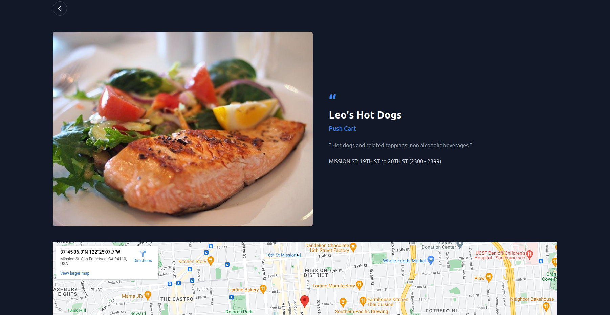

# Food Truck

Simple example of uploading and using initial data in django

the test data in `./utils/data/`

---

# Running Project

## Running with Docker:

you can run the project with docker directly

```
docker build . -t food-truck
docker run -p 8000:8000 food-truck
```

that's it ! you can go http://localhost:8000/

---

## or Run Manually:

### 1. First you should create a virtual env and install requirements

```
python -m venv venv
source venv/bin/activate

pip install -r requirements.txt
```

### 2. Migrate migrations and Load initial data

this code should create a sqlite3 file which is creating for only test purpose

```
python manage.py migrate
python manage.py load_foods
```

### 3. Run the code

```
python manage.py runserver
```

and you can go http://localhost:8000/

thats it!

---

# Some examples in our app



